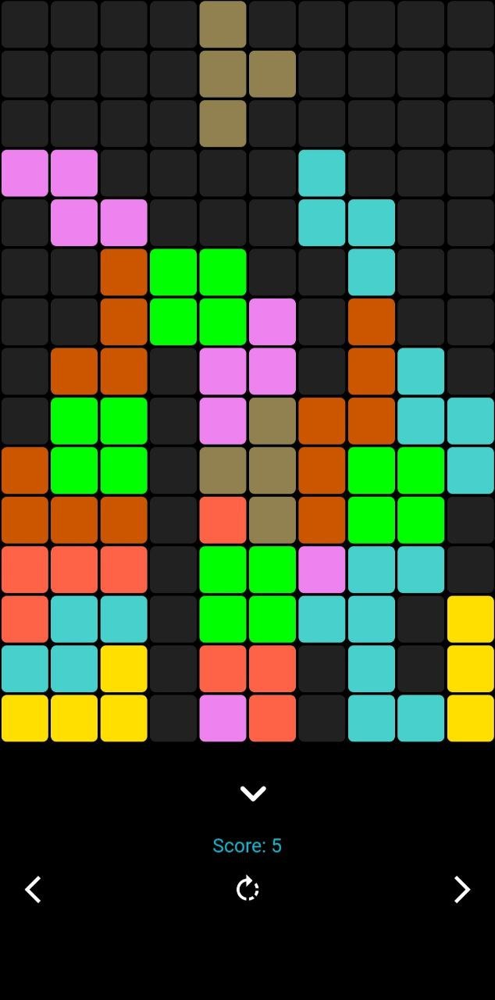
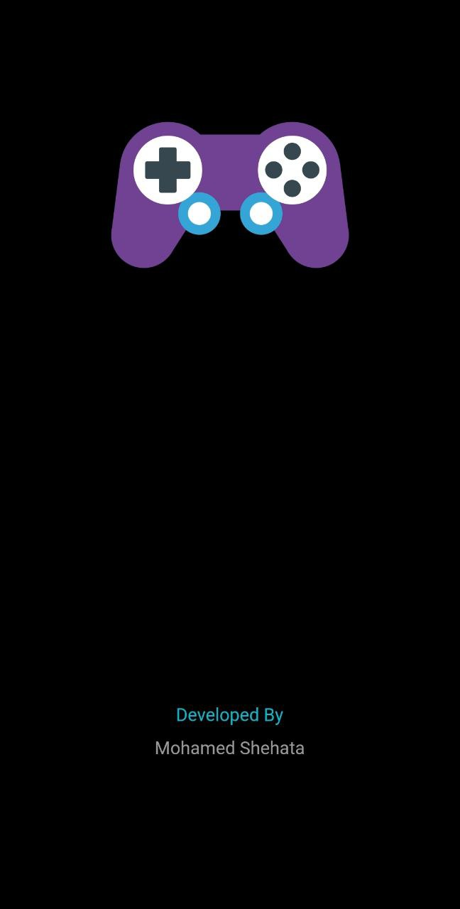
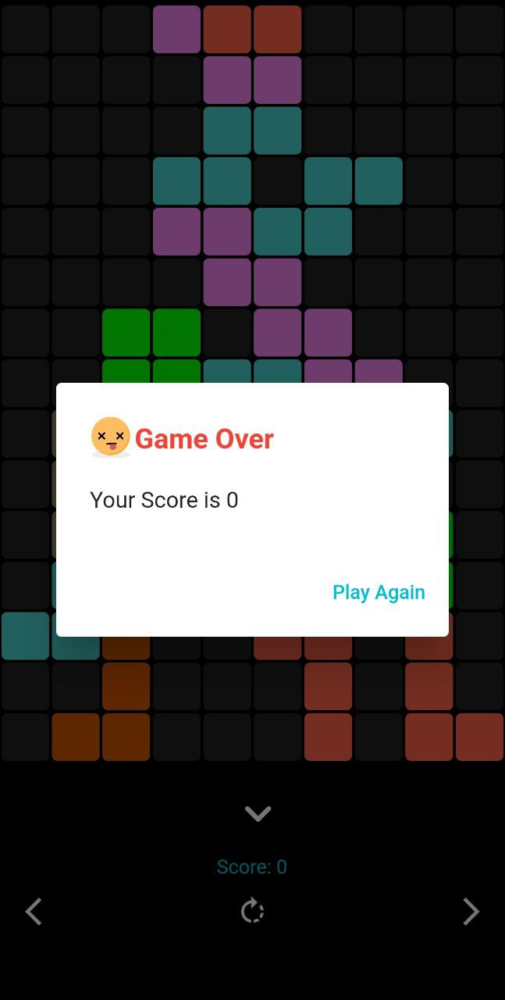

# Tetris Game

Welcome to the Tetris Game repository! This classic game brings back nostalgic memories while providing an enjoyable and challenging experience. Play the game and see how many lines you can clear.

## Gameplay

In Tetris, various shaped blocks called tetrominoes fall from the top of the screen. Your goal is to rotate and move these tetrominoes as they descend to create solid lines across the playing field. Each completed line disappears, giving you points and making room for more tetrominoes.

## Features

- Intuitive controls for moving and rotating tetrominoes
- Score tracking and level progression
- Increasing game speed as you clear more lines
- Game over when tetrominoes reach the top

## How to Play

1. Clone this repository to your local machine.
2. Open the project in your preferred Flutter development environment.
3. Run the app on an emulator or a physical device.
4. Use on-screen controls to move and rotate tetrominoes.
5. Aim to clear as many lines as possible to score points.

## Screenshots

## Contributing

Contributions to improve the game are welcome! If you'd like to contribute, please follow these steps:

1. Fork the repository.
2. Create a new branch for your feature or bug fix.
3. Implement your changes and improvements.
4. Test thoroughly and ensure existing functionality is not affected.
5. Open a pull request detailing your changes.

## License

This project is licensed under the [MIT License](LICENSE).

